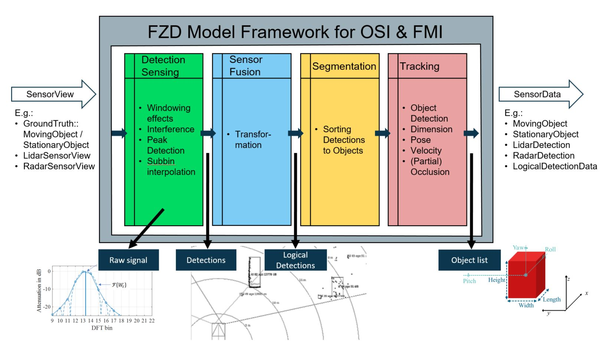

# SL 1-1 Reflection Based Radar Object Model

[](https://github.com/openMSL/sl-1-0-sensor-model-repository-template/actions/workflows/test_pipeline.yml)


This model is a Reflection Based Radar Model based on the [Modular OSMP Framework](https://gitlab.com/tuda-fzd/perception-sensor-modeling/modular-osmp-framework) by FZD.
It is a highly parameterizable sensor system model including detection calculation and object tracking simulation.
The model received radar reflection data calculated in a simulation tool beforehand e.g. with ray tracing.
The model outputs are radar detections and detected moving objects.<br><br>


## Modeling Approach

### Modeling Framework

The outer layer of the model is the [Modular OSMP Framework](https://gitlab.com/tuda-fzd/perception-sensor-modeling/modular-osmp-framework) by FZD.
It specifies ways in which models using the [Open Simulation Interface (OSI)](https://github.com/OpenSimulationInterface/open-simulation-interface) are to be packaged for their use in simulation environments using [FMI 2.0](https://fmi-standard.org).

The actual logic of the model is packed in so-called strategies.
This is where the magic happens.
The `apply()` function of the strategy is called by the `do_calc()` function of the Framework.
There are four subsequent strategies as shown in the image below.



### Modeling of FFT and windowing processing by [Fouriertracing](https://tuprints.ulb.tu-darmstadt.de/17545/1/Dissertation_Martin_Holder_2021.pdf)

The reflections of e.g. a raytracer are the input of the model.
As a first step, every reflection is interpreted as a delta-peak and sorted into the corresponding range, doppler and azimuth bin based on the FFT discretization of the radar sensor system (elevation right now not considered).
Next, the delta-peaks are smeared with a window function lookup-table into the neighboring cells of the radar cuboid (3D FFT output) under consideration of the complex power.
The result is the complex radar cuboid at the current timestamp.
The general process is visualized by the following pictures.
On the left side the smearing of the delta-peak into the adjacent bins due to the window function is shown.
The picture on the right side visualizes the superposition of two different delta-peaks based on a varying bin distance.


Afterwards an OS-CFAR peak detection is applied to the cuboid.
The output of the DetectionSensing is an osi3::RadarDetection message.<br><br>

After transformation of the detections from the sensor's spherical coordinates to the vehicle's Cartesian coordinates, they are available as osi3::LogicalDetections.
Subsequently, the tracking-strategy is applied on the calculated logical detections.
It uses the extreme points of the detections for every object for dimension and pose estimation.
At first, position, orientation, and dimensions are estimated as the detected object state.
The detected objects are compared to a list of previously detected and tracked objects and thereby added, updated or possibly deleted.
The track logic can be specified in the model profile.
It specifies e.g. the number of consecutive cycles an object has to be detected to create a new track or how many cycles an object is tracked without any detection.
Therefore, objects that are hidden now, but where previously detected, are still tracked estimating their movement by either using ground truth information or by predictions based on detected objects of the previous time steps.
The estimation of the object dimensions is also considered and filtered over several cycles.
If an object is no longer detected over a defined number of cycles, it is deleted from the list.
Consideration of the class uncertainties is provided by the model architecture, as well.
The output of the tracking module is a list of tracked objects.

## Parameterization

The profiles are parameterized in the files `profile_*.hpp.in`.
The parameters are defined in the files `profile.hpp.in`.
The profiles can be extended by the strategies with additional parameters and values in their respective folders as in e.g. `src/model/strategies/radar-tracking-strategy/` with `profile_struct.hpp.in` with the parameters and `profile_*.hpp.in` with the values.

The profile to be loaded for simulation is set via a model parameter defined in the `modelDescription.xml` of the FMU.
The first name in `src/model/profiles/profile_list.conf` is taken as default.
If you would like to have a different one or if your simulation master does not support the configuration of model parameters, you have to adapt the *start* value of the parameter `profile` in `src/osmp/modelDescription.in.xml`.

### Sensor Parameters

| Parameter                         | Description                                                                                                                       |
| --------------------------------- | --------------------------------------------------------------------------------------------------------------------------------- |
| sensor_view_configuration*        | Update cycle, range, field of view, physical mounting position w.r.t. center of rear axle                                         |
| radar_sensor_view_configuration** | Emitter's mounting position w.r.t. center of rear axle, emitter_frequency, tx/rx_antenna_diagram                           |

*sensor_view_configuration is defined for every physical sensor system mounted on the ego car<br>
**radar_sensor_view_configuration is defined for every emitter located within every sensor system

### Detection Sensing Parameters

| Parameter                      | Description                                                                                               |
| ------------------------------ | --------------------------------------------------------------------------------------------------------- |
| range_resolution               | Range resolution in m                                                                                     |
| doppler_resolution             | Doppler resolution in m/s                                                                                 |
| azimuth_resolution             | Azimuth resolution in rad                                                                                 |
| number_range_bin               | Number of range bins                                                                                      |
| number_doppler_bin             | Number of doppler bins                                                                                    |
| number_azimuth_bin             | Number of azimuth bins                                                                                    |
| range_window_function          | Window function lookup-table for range                                                                    |
| doppler_window_function        | Window function lookup-table for doppler                                                                  |
| azimuth_window_function        | Window function lookup-table for azimuth                                                                  |
| window_data_per_bin            | Data points per bin in the look-up table                                                                  |
| bin_affect_range               | Number of bins that are effected by the windowing function                                                |

### CFAR Peakdetection parameters

| Parameter                      | Description                                                                                               |
| ------------------------------ | --------------------------------------------------------------------------------------------------------- |
| emitter_strength               | Power of the emitter                                                                                      |
| range_CFAR_window_size         | Size of the range CFAR window in bins                                                                     |
| range_CFAR_ref_pos             | Position of the range reference value for peak identification                                             |
| range_CFAR_factor              | CFAR constant for range reference value calculation                                                       |
| azimuth_CFAR_window_size       | Size of the azimuth CFAR window in bins                                                                   |
| azimuth_CFAR_ref_pos           | Position of the azimuth reference value for peak identification                                           |
| azimuth_CFAR_factor            | CFAR constant for azimuth reference value calculation                                                     |
| noise_value                    | Randomized noise value distributed as exponential distribution if reference value is 0                    |
| lookup_size_interpolation      | Size of lookup-table for range, doppler, azimuth interpolation by a parabola function                     |
| lookup_stepsize_interpolation  | Size of the steps for the interpolation function                                                          |
| lookup_range_interpolation     | Values of parabola function as lookup-table for range interpolation                                       |
| lookup_doppler_interpolation   | Values of parabola function as lookup-table for range interpolation                                       |
| lookup_azimuth_interpolation   | Values of parabola function as lookup-table for azimuth interpolation                                     |
| max_number_detections          | Maximum number of detections during one measurement cycle                                                 |
| power_threshold                | Threshold for determination doppler bin in Peakdetection                                                  |
| num_peaks_max                  | Maximum number of peaks in doppler dimension per range bin                                                |
| rcs_calibration                | RCS calibration value of the sensor                                                                       |

### Segmentation Parameters

| Parameter                  | Description                                                                    |
| -------------------------- | ------------------------------------------------------------------------------ |
| tolerance_for_segmentation | Tolerance in m that is added to object dimensions for point cloud segmentation |

### Object Tracking Parameters

| Parameter                                    | Description                                                  |
| -------------------------------------------- | ------------------------------------------------------------ |
| classification_flag                          | 0 = from ground truth; 1 = all "Unknown Big"                 |
| orientation_flag                             | 0 = from ground truth; 1 = from current point cloud segment  |
| dimension_and_position_flag                  | 0 = from ground truth;<br/>1 = from current point cloud segment;<br/>2 = dimension from current point cloud segments with lower bounds, position as center of manipulated pcl segment;<br/>3 = maximum dimension of current and mean of historical point cloud segments, position as center of manipulated pcl segment;<br/>4 = maximum dimension of current and mean of historical point cloud segments with lower bounds, position as center of manipulated pcl segment; |
| minimum_object_dimension                     | Minimum dimension in m for detected objects                  |
| historical_limit_dimension                   | Limits the historical data used for historical mean dimension calculation |
| velocity_flag                                | 0 = from ground truth; 1 = derivation of position            |
| tracking_flag                                | 0 = ideal (track all ground truth objects); 1 = realistic tracking behavior |
| existence_probability_threshold_for_tracking | Threshold for existence probability, tracking is enabled above threshold |
| min_detections_in_segment_for_tracking       | Minimum no. of detections per segment to track it            |
| existence_probability_increment              | Increment for existence probability                          |
| existence_probability_decrement              | Decrement for existence probability                          |

## Configuration

### Model name

The model's name (in this case "ReflectionBasedRadarModel") used for CMake-projects and the FMU at the end is defined in file `model_name.conf` located at `src/model`.

### Install path

When building and installing, the framework will build an FMU package into `FMU_INSTALL_DIR`, which can be used with a simulation tool that supports OSI and fills the required fields listed below.

### VariableNamingConvention

The parameter variableNamingConvention for the FMU specified within the modelDescription.xml is taken from file `variableNamingConvention.conf` located at `src/osmp`.
Possible values are "flat" or "structured".

## Inferface

### Required SensorViewConfiguration (parameterized in profile_*.hpp.in) to be Set in the Simulation Tool

- For every simulated physical sensor system:
  - sensor_view_configuration.mounting_position.position
  - sensor_view_configuration.mounting_position.orientation
  - sensor_view_configuration.update_cycle_time
  - sensor_view_configuration.range
  - sensor_view_configuration.field_of_view_horizontal
  - sensor_view_configuration.field_of_view_vertical
- For every simulated radar signal emitter per sensor system:
  - sensor_view_configuration.radar_sensor_view_configuration.mounting_position.orientation
  - sensor_view_configuration.radar_sensor_view_configuration.field_of_view_horizontal
  - sensor_view_configuration.radar_sensor_view_configuration.mounting_position.position
  - sensor_view_configuration.radar_sensor_view_configuration.field_of_view_vertical
  - sensor_view_configuration.radar_sensor_view_configuration.emitter_frequency
  - sensor_view_configuration.radar_sensor_view_configuration.tx_antenna_diagram
  - sensor_view_configuration.radar_sensor_view_configuration.rx_antenna_diagram

### Required Fields in OSI3 Sensor_View Filled at the Input by the Simulation Tool

- Ground Truth object list
  - sensor_view.mounting_position
  - sensor_view.global_ground_truth.timestamp
  - sensor_view.global_ground_truth.host_vehicle_id
  - sensor_view.global_ground_truth.stationary_object.id
  - sensor_view.global_ground_truth.stationary_object.base.position
  - sensor_view.global_ground_truth.stationary_object.base.orientation
  - sensor_view.global_ground_truth.stationary_object.base.dimension
  - sensor_view.global_ground_truth.stationary_object.classification.type
  - sensor_view.global_ground_truth.moving_object.id
  - sensor_view.global_ground_truth.moving_object.base.position
  - sensor_view.global_ground_truth.moving_object.base.orientation
  - sensor_view.global_ground_truth.moving_object.base.orientation_rate
  - sensor_view.global_ground_truth.moving_object.base.velocity
  - sensor_view.global_ground_truth.moving_object.base.acceleration
  - sensor_view.global_ground_truth.moving_object.base.dimension
  - sensor_view.global_ground_truth.moving_object.type
  - sensor_view.global_ground_truth.moving_object.vehicle_classification.type
  - sensor_view.global_ground_truth.moving_object.vehicle_attributes.bbcenter_to_rear
  - sensor_view.global_ground_truth.moving_object.vehicle_attributes.ground_clearance
- Radar reflections
  - sensor_view.radar_sensor_view.reflection.time_of_flight
  - sensor_view.radar_sensor_view.reflection.signal_strength
  - sensor_view.radar_sensor_view.reflection.doppler_shift
  - sensor_view.radar_sensor_view.reflection.azimuth_angle

### Additionally Filled Fields in OSI3 Sensor_Data by the Sensor Model

Currently, all information on model input is passed to the output.

- sensor_data.timestamp
- sensor_data.moving_object_header.measurement_time
- sensor_data.moving_object_header.cycle_counter
- sensor_data.moving_object_header.data_qualifier
- sensor_data.moving_object.header.ground_truth_id
- sensor_data.moving_object.header.tracking_id
- sensor_data.moving_object.header.age
- sensor_data.moving_object.base.position
- sensor_data.moving_object.base.orientation
- sensor_data.moving_object.base.orientation_rate
- sensor_data.moving_object.base.velocity
- sensor_data.moving_object.base.acceleration
- sensor_data.moving_object.base.dimension
- sensor_data.moving_object.reference_point
- sensor_data.moving_object.movement_state
- sensor_data.moving_object.candidate.probability
- sensor_data.moving_object.candidate.type

## Build Instructions in Windows 10

### Install Dependencies in Windows 10

1. Install [cmake](https://github.com/Kitware/CMake/releases/download/v3.20.3/cmake-3.20.3-windows-x86_64.msi)
2. Install protobuf for [MSYS-2020](doc/build-instructions/install_protobuf_Win64_MSYS-2020.md) or [Visual Studio 2017](doc/build-instructions/install_protobuf_Win64_VS2017.md)

### Clone with Submodules, Build, and Install in Windows 10

1. Clone this repository *with submodules*:

   ```bash
   git clone git@github.com:openMSL/reflection_based_radar_object_model.git --recurse-submodules
   ```

2. Build the model in [MSYS-2020](doc/build-instructions/install_model_Win64_MSYS-2020.md) or [Visual Studio 2017](doc/build-instructions/install_model_Win64_VS2017.md)
3. Take FMU from `FMU_INSTALL_DIR`

(Please note that sources are not packed into the FMU at the moment.)

## Build Instructions in Ubuntu 18.04 / 20.04

### Install Dependencies in Ubuntu 18.04 / 20.04

1. Install cmake 3.12
   - as told in [these install instructions](doc/build-instructions/install_cmake_ubuntu_3-12.md)
2. Install protobuf 3.0.0:
   - Check your version via `protoc --version`. It should output: `libprotoc 3.0.0`
   - If needed, you can install it via `sudo apt-get install libprotobuf-dev protobuf-compiler`
   - or from source:
     - Download [source](https://github.com/protocolbuffers/protobuf/releases/tag/v3.0.0) and extract the archive.
     - Try to run `./autogen.sh`, if it fails, download the [gmock-1.7.0.zip](https://pkgs.fedoraproject.org/repo/pkgs/gmock/gmock-1.7.0.zip/073b984d8798ea1594f5e44d85b20d66/gmock-1.7.0.zip), extract it into the protobuf folder and rename the gmock-1.7.0 folter to gmock.
     - Proceed with the installation with

     ```bash
     make
     sudo make install
     sudo ldconfig # refresh shared library cache.
     ```

### Clone with Submodules, Build, and Install in Ubuntu 18.04 / 20.04

1. Clone this repository *with submodules*:

    ```bash
    git clone git@github.com:openMSL/reflection_based_radar_object_model.git --recurse-submodules
    ```

2. Build the model by executing in the extracted project root directory:

    ```bash
    mkdir cmake-build
    cd cmake-build
    # If FMU_INSTALL_DIR is not set, CMAKE_BINARY_DIR is used
    cmake -DCMAKE_BUILD_TYPE=Release -DFMU_INSTALL_DIR:PATH=/tmp ..
    make -j N_JOBS
    ```

3. Take FMU from `FMU_INSTALL_DIR`

(Please note that sources are not packed into the FMU at the moment.)

## Credits

M. F. Holder, C. Linnhoff, P. Rosenberger, and H. Winner, [*“The Fourier Tracing Approach for Modeling Automotive Radar Sensors,”*](https://ieeexplore.ieee.org/document/8768113) 20th International Radar Symposium (IRS), Ulm, Germany, 26-28 June 2019

If you find our work useful in your research, please consider citing:

```bibtex
@INPROCEEDINGS{holder2019,
  author={Holder, Martin and Linnhoff, Clemens and Rosenberger, Philipp and Winner, Hermann},
  booktitle={2019 20th International Radar Symposium (IRS)}, 
  title={The Fourier Tracing Approach for Modeling Automotive Radar Sensors}, 
  year={2019},
  doi={10.23919/IRS.2019.8768113}}
}
```

This work received funding from the research project
"[SET Level](https://setlevel.de/)" of the [PEGASUS](https://pegasus-family.de) project family, promoted by the German Federal Ministry for Economic Affairs and Energy based on a decision of the German Bundestag.
| SET Level                                                                                                | PEGASUS Family                                                                                                       | BMWi                                                                                                                                                                                 |
|----------------------------------------------------------------------------------------------------------|----------------------------------------------------------------------------------------------------------------------|--------------------------------------------------------------------------------------------------------------------------------------------------------------------------------------|
| <a href="https://setlevel.de"></a> | <a href="https://pegasus-family.de"></a> | <a href="https://www.bmwi.de/Redaktion/DE/Textsammlungen/Technologie/fahrzeug-und-systemtechnologien.html"></a> |

Thanks to all contributors of the following libraries:

- [Open Simulation Interface](https://github.com/OpenSimulationInterface/open-simulation-interface), a generic interface based on protocol buffers for the environmental perception of automated driving functions in virtual scenarios
- [FMI Version 2.0: FMI for Model Exchange and Co-Simulation](https://fmi-standard.org/downloads/)
- [Eigen](http://eigen.tuxfamily.org/), a C++ template library for linear algebra: matrices, vectors, numerical solvers, and related algorithms.
